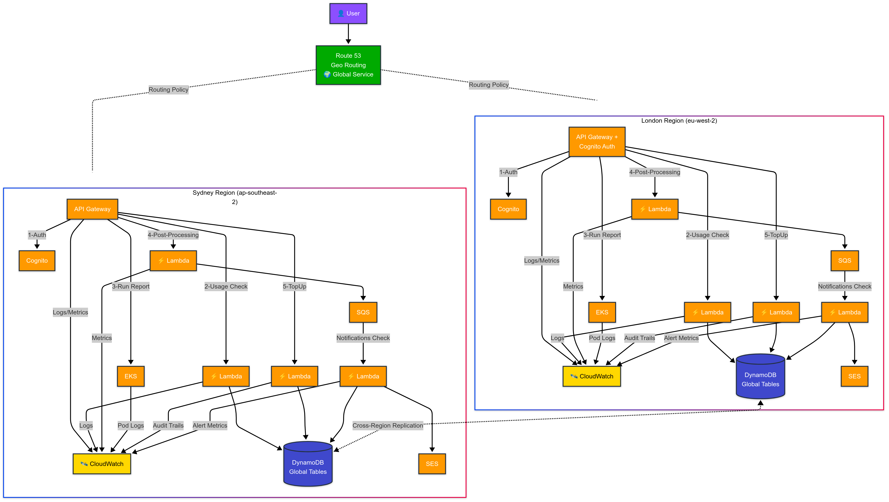

# Multi-Region AWS Infrastructure

Complete, Production-Grade, Terraform infrastructure for a multi-region reporting application with usage limits, credit management, and global DNS routing.

## 🏗️ Architecture Overview



The complete multi-region infrastructure spans London (eu-west-2) and Sydney (ap-southeast-2) regions with global DNS routing for optimal user experience.

## 📁 Project Structure

```
cutlass-tech/
├── bootstrap/                   # S3 backend + DynamoDB locks
├── 000-base-network/            # VPC, subnets, gateways
├── 100-data-layer/              # DynamoDB Global Tables
├── 200-compute-layer/           # Lambda functions
├── 300-api-layer/               # API Gateway + Cognito
├── 400-messaging-layer/         # SQS + SES
├── 900-global-services/         # Route 53 geo-routing
└── README.md                    # This file
```

## 🔧 Terraform Workspaces Strategy

This infrastructure leverages **Terraform workspaces** to deploy the same source code across multiple regions and multiple AWS accounts with environment and region-specific configurations. This approach provides several key benefits:

### Why Terraform Workspaces?

- **Single Source of Truth**: One codebase maintains consistency across all regions and environments
- **DRY Principle**: Avoid duplicating infrastructure code for each region and environment
- **Account Isolation**: Complete separation between Dev, Staging, and Production AWS accounts
- **Centralized Management**: Unified state management with environment and region-specific state files
- **Simplified Maintenance**: Updates to infrastructure logic apply to all environments and regions
- **Cost Efficiency**: Shared S3 backend per account with separate state files per workspace

### Workspace Architecture

```
Multi-Account + Multi-Region Structure:
├── Dev Account (111111111111)
│   ├── S3 Backend: cutlass-tech-terraform-state-111111111111
│   ├── DynamoDB Locks: cutlass-tech-terraform-locks
│   └── Workspaces:
│       ├── env:/dev-london/[layer]/terraform.tfstate
│       └── env:/dev-sydney/[layer]/terraform.tfstate
├── Staging Account (222222222222)
│   ├── S3 Backend: cutlass-tech-terraform-state-222222222222
│   ├── DynamoDB Locks: cutlass-tech-terraform-locks
│   └── Workspaces:
│       ├── env:/staging-london/[layer]/terraform.tfstate
│       └── env:/staging-sydney/[layer]/terraform.tfstate
├── Production Account (333333333333)
│   ├── S3 Backend: cutlass-tech-terraform-state-333333333333
│   ├── DynamoDB Locks: cutlass-tech-terraform-locks
│   └── Workspaces:
│       ├── env:/prod-london/[layer]/terraform.tfstate
│       └── env:/prod-sydney/[layer]/terraform.tfstate
└── Configuration Files:
    ├── vars/dev-london.tfvars
    ├── vars/dev-sydney.tfvars
    ├── vars/staging-london.tfvars
    ├── vars/staging-sydney.tfvars
    ├── vars/prod-london.tfvars
    ├── vars/prod-sydney.tfvars
    ├── backend-config-dev.hcl
    ├── backend-config-staging.hcl
    └── backend-config-prod.hcl
```

### How Workspaces Enable Multi-Account + Multi-Region Deployment

1. **Account and Region-Specific State Isolation**
   - Each workspace maintains its own state file per AWS account and region combination
   - Dev London: `env:/dev-london/[layer]/terraform.tfstate` (in Dev Account S3 bucket)
   - Dev Sydney: `env:/dev-sydney/[layer]/terraform.tfstate` (in Dev Account S3 bucket)
   - Staging London: `env:/staging-london/[layer]/terraform.tfstate` (in Staging Account S3 bucket)
   - Staging Sydney: `env:/staging-sydney/[layer]/terraform.tfstate` (in Staging Account S3 bucket)
   - Prod London: `env:/prod-london/[layer]/terraform.tfstate` (in Production Account S3 bucket)
   - Prod Sydney: `env:/prod-sydney/[layer]/terraform.tfstate` (in Production Account S3 bucket)

2. **Multi-Environment Variable File Strategy**
   - **dev-london.tfvars**: Dev account London-specific configurations
   - **staging-sydney.tfvars**: Staging account Sydney-specific configurations
   - **prod-london.tfvars**: Production account London-specific configurations
   - Environment-specific settings for scaling, security, and compliance

3. **Account-Specific Provider Configuration**
   ```hcl
   provider "aws" {
     region = var.aws_region
     
     # Uses AWS credentials/profile for target account
     # No cross-account assume role needed
     
     default_tags {
       tags = {
         Environment = var.environment  # dev/staging/prod
         Region      = var.region       # london/sydney
         Workspace   = terraform.workspace
         Account     = var.aws_account_id
       }
     }
   }
   ```

4. **Workspace-Aware Resource Naming**
   ```hcl
   # Resources get environment and region context
   resource "aws_vpc" "main" {
     cidr_block = var.vpc_cidr
     
     tags = {
       Name = "cutlass-tech-vpc-${var.environment}-${var.region}"
       Environment = var.environment
       Region = var.region
       Account = var.aws_account_id
     }
   }
   ```

5. **Conditional Resource Creation**
   ```hcl
   # Create Global Tables only in production London
   resource "aws_dynamodb_global_table" "usage_credits" {
     count = var.environment == "prod" && var.region == "london" ? 1 : 0
     name  = "cutlass-tech-usage-credits-${var.environment}"
     
     replica {
       region_name = "eu-west-2"
     }
     
     replica {
       region_name = "ap-southeast-2"
     }
   }
   ```

### Workspace Commands Reference

```bash
# List all workspaces
terraform workspace list

# Create new workspace
terraform workspace new <environment-region>

# Switch to workspace
terraform workspace select <environment-region>

# Show current workspace
terraform workspace show

# Delete workspace (careful!)
terraform workspace delete <environment-region>
```

### Variable File Structure

#### Dev Environment Configuration (vars/dev-london.tfvars)
```hcl
# AWS Account Configuration
aws_region = "eu-west-2"
aws_account_id = "111111111111"

# Environment settings
environment = "dev"
region = "london"

# Network configuration (dev-specific)
vpc_cidr = "10.0.0.0/16"
public_subnet_cidrs = ["10.0.1.0/24", "10.0.2.0/24"]
private_subnet_cidrs = ["10.0.3.0/24", "10.0.4.0/24"]

# Resource sizing (smaller for dev)
lambda_memory_size = 256
api_gateway_stage = "dev"
enable_detailed_monitoring = false

# Domain configuration
domain_name = "api-dev-london.your-domain.com"
certificate_arn = "arn:aws:acm:eu-west-2:111111111111:certificate/..."
```

#### Staging Environment Configuration (vars/staging-london.tfvars)
```hcl
# AWS Account Configuration
aws_region = "eu-west-2"
aws_account_id = "222222222222"

# Environment settings
environment = "staging"
region = "london"

# Network configuration
vpc_cidr = "10.0.0.0/16"
public_subnet_cidrs = ["10.0.1.0/24", "10.0.2.0/24"]
private_subnet_cidrs = ["10.0.3.0/24", "10.0.4.0/24"]

# Resource sizing (medium for staging)
lambda_memory_size = 512
api_gateway_stage = "staging"
enable_detailed_monitoring = true

# Domain configuration
domain_name = "api-staging-london.your-domain.com"
certificate_arn = "arn:aws:acm:eu-west-2:222222222222:certificate/..."
```

#### Production Environment Configuration (vars/prod-london.tfvars)
```hcl
# AWS Account Configuration
aws_region = "eu-west-2"
aws_account_id = "333333333333"

# Environment settings
environment = "prod"
region = "london"

# Network configuration
vpc_cidr = "10.0.0.0/16"
public_subnet_cidrs = ["10.0.1.0/24", "10.0.2.0/24"]
private_subnet_cidrs = ["10.0.3.0/24", "10.0.4.0/24"]

# Resource sizing (larger for production)
lambda_memory_size = 1024
api_gateway_stage = "prod"
enable_detailed_monitoring = true
enable_enhanced_security = true

# Domain configuration
domain_name = "api-london.your-domain.com"
certificate_arn = "arn:aws:acm:eu-west-2:333333333333:certificate/..."
```

### Backend Configuration Per AWS Account

Each AWS account requires its own S3 backend and DynamoDB table for state management:

#### Dev Account Backend (backend-config-dev.hcl)
```hcl
bucket         = "cutlass-tech-terraform-state-111111111111"
key            = "layers/000-base-network/terraform.tfstate"
region         = "eu-west-2"
dynamodb_table = "cutlass-tech-terraform-locks"
encrypt        = true
workspace_key_prefix = "env"
```

#### Staging Account Backend (backend-config-staging.hcl)
```hcl
bucket         = "cutlass-tech-terraform-state-222222222222"
key            = "layers/000-base-network/terraform.tfstate"
region         = "eu-west-2"
dynamodb_table = "cutlass-tech-terraform-locks"
encrypt        = true
workspace_key_prefix = "env"
```

#### Production Account Backend (backend-config-prod.hcl)
```hcl
bucket         = "cutlass-tech-terraform-state-333333333333"
key            = "layers/000-base-network/terraform.tfstate"
region         = "eu-west-2"
dynamodb_table = "cutlass-tech-terraform-locks"
encrypt        = true
workspace_key_prefix = "env"
```

### Best Practices for Multi-Account + Multi-Region Workspaces

1. **Workspace Naming Conventions**
   - Use compound naming: `{environment}-{region}`
   - Examples: `dev-london`, `staging-sydney`, `prod-london`
   - Consistent across all layers and teams

2. **State Management Per Account**
   - Separate S3 backend per AWS account
   - Independent DynamoDB lock tables
   - Complete account-level isolation

3. **AWS Profile/Credential Management**
   - Direct AWS credentials for each target account
   - No cross-account IAM roles required
   - Use AWS profiles or environment-specific credentials

4. **Variable Organization**
   - Environment and region-specific variable files
   - Account-specific backend configurations
   - Clear naming conventions and documentation

5. **Deployment Order and Dependencies**
   - Bootstrap each account independently
   - Deploy environments in sequence (dev → staging → prod)
   - Consider cross-region dependencies (Global Tables)

6. **Environment-Specific Configurations**
   ```hcl
   # Example: Different resource sizing per environment
   variable "lambda_memory_size" {
     description = "Lambda memory allocation"
     type        = number
     default = {
       dev     = 256
       staging = 512
       prod    = 1024
     }
   }
   
   resource "aws_lambda_function" "api" {
     memory_size = var.lambda_memory_size[var.environment]
   }
   ```

## 🚀 Deployment Guide

### Prerequisites

1. **AWS CLI** configured with appropriate permissions for each account
2. **Terraform** >= 1.0 installed
3. **Domain ownership** for Route 53 configuration
4. **AWS Account IDs** for S3 backend configuration across environments
5. **AWS Profiles or Credentials** configured for each target account (dev, staging, production)

### Step 1: Bootstrap (Per AWS Account)

**IMPORTANT**: Each AWS account needs its own S3 backend and DynamoDB table.

```bash
# Bootstrap Dev Account (111111111111)
export AWS_PROFILE=dev-account  # Configure for dev account
cd bootstrap
terraform init
terraform apply
# Creates: cutlass-tech-terraform-state-111111111111

# Bootstrap Staging Account (222222222222)
export AWS_PROFILE=staging-account  # Configure for staging account
cd bootstrap
terraform init
terraform apply
# Creates: cutlass-tech-terraform-state-222222222222

# Bootstrap Production Account (333333333333)
export AWS_PROFILE=prod-account  # Configure for production account
cd bootstrap
terraform init
terraform apply
# Creates: cutlass-tech-terraform-state-333333333333
```

### Step 2: Base Network Layer

```bash
cd 000-base-network

# Deploy to Dev Account
terraform init -backend-config=backend-config-dev.hcl

# Deploy Dev London
terraform workspace new dev-london
terraform plan -var-file=vars/dev-london.tfvars
terraform apply -var-file=vars/dev-london.tfvars

# Deploy Dev Sydney
terraform workspace new dev-sydney
terraform plan -var-file=vars/dev-sydney.tfvars
terraform apply -var-file=vars/dev-sydney.tfvars

# Deploy to Staging Account (requires backend reconfiguration)
terraform init -reconfigure -backend-config=backend-config-staging.hcl

# Deploy Staging London
terraform workspace new staging-london
terraform plan -var-file=vars/staging-london.tfvars
terraform apply -var-file=vars/staging-london.tfvars

# Deploy Staging Sydney
terraform workspace new staging-sydney
terraform plan -var-file=vars/staging-sydney.tfvars
terraform apply -var-file=vars/staging-sydney.tfvars

# Deploy to Production Account (requires backend reconfiguration)
terraform init -reconfigure -backend-config=backend-config-prod.hcl

# Deploy Production London
terraform workspace new prod-london
terraform plan -var-file=vars/prod-london.tfvars
terraform apply -var-file=vars/prod-london.tfvars

# Deploy Production Sydney
terraform workspace new prod-sydney
terraform plan -var-file=vars/prod-sydney.tfvars
terraform apply -var-file=vars/prod-sydney.tfvars
```

### Step 3: Data Layer (DynamoDB Global Tables)

**IMPORTANT**: Deploy London first in each environment, then Sydney.

```bash
cd 100-data-layer

# Deploy to Dev Account
terraform init -backend-config=backend-config-dev.hcl

# Deploy Dev London FIRST (creates Global Tables)
terraform workspace new dev-london
terraform plan -var-file=vars/dev-london.tfvars
terraform apply -var-file=vars/dev-london.tfvars

# Deploy Dev Sydney SECOND (manages local resources)
terraform workspace new dev-sydney
terraform plan -var-file=vars/dev-sydney.tfvars
terraform apply -var-file=vars/dev-sydney.tfvars

# Repeat for Staging Account
terraform init -reconfigure -backend-config=backend-config-staging.hcl
terraform workspace new staging-london
terraform apply -var-file=vars/staging-london.tfvars
terraform workspace new staging-sydney
terraform apply -var-file=vars/staging-sydney.tfvars

# Repeat for Production Account
terraform init -reconfigure -backend-config=backend-config-prod.hcl
terraform workspace new prod-london
terraform apply -var-file=vars/prod-london.tfvars
terraform workspace new prod-sydney
terraform apply -var-file=vars/prod-sydney.tfvars
```

### Step 4: Compute Layer (Lambda Functions)

```bash
cd 200-compute-layer

# Create lambda_packages directory
mkdir -p lambda_packages

# Deploy to each account following the same pattern as previous steps
# (Dev → Staging → Production with backend reconfiguration)
```

### Step 5: API Layer (API Gateway + Cognito)

```bash
cd 300-api-layer

# Deploy to each account following the same pattern
# Remember to reconfigure backend for each account
```

### Step 6: Messaging Layer (SQS + SES)

```bash
cd 400-messaging-layer

# Deploy to each account following the same pattern
```

### Step 7: Global Services (Route 53)

```bash
cd 900-global-services

# Deploy global resources per environment
# Each environment gets its own global DNS configuration
```

## 🔧 Configuration

### Required Updates

Before deployment, update these configuration files:

1. **AWS Account IDs**: Replace account IDs in all configuration files:
   - `111111111111` → Your Dev Account ID
   - `222222222222` → Your Staging Account ID  
   - `333333333333` → Your Production Account ID

2. **AWS Profiles**: Configure AWS CLI profiles for each account or set appropriate credentials
3. **Domain Names**: Update domain configurations per environment
4. **Certificate ARNs**: Update SSL certificate ARNs per account/region

### Environment-Specific Configuration

| File | Purpose | Key Settings |
|------|---------|--------------|
| `vars/dev-london.tfvars` | Dev account London config | Dev account ID, smaller resources, dev domain |
| `vars/dev-sydney.tfvars` | Dev account Sydney config | Dev account ID, smaller resources, dev domain |
| `vars/staging-london.tfvars` | Staging account London config | Staging account ID, medium resources, staging domain |
| `vars/staging-sydney.tfvars` | Staging account Sydney config | Staging account ID, medium resources, staging domain |
| `vars/prod-london.tfvars` | Production account London config | Prod account ID, full resources, production domain |
| `vars/prod-sydney.tfvars` | Production account Sydney config | Prod account ID, full resources, production domain |
| `backend-config-dev.hcl` | Dev account backend config | Dev S3 bucket, state management |
| `backend-config-staging.hcl` | Staging account backend config | Staging S3 bucket, state management |
| `backend-config-prod.hcl` | Production account backend config | Production S3 bucket, state management |

## 🎯 Key Features

### Multi-Account + Multi-Region Setup
- **Dev Account (111111111111)**: Development environment across London and Sydney
- **Staging Account (222222222222)**: Pre-production testing environment
- **Production Account (333333333333)**: Live production environment
- **Complete Account Isolation**: Independent state management and resource isolation
- **DynamoDB Global Tables**: Per-environment bidirectional data replication

### Authentication & Authorization
- **Cognito User Pools**: OAuth 2.0 authentication per region and environment
- **API Gateway Authorizers**: JWT token validation with environment-specific configurations

### Usage Management
- **Usage Plans**: Basic, premium, enterprise tiers per environment
- **Credit System**: Organization and user-level credits with environment isolation
- **Threshold Monitoring**: Automated usage alerts per environment

### Messaging & Notifications
- **SQS Queues**: Async notification processing per environment
- **SES Templates**: Usage alerts with environment-specific templates
- **Dead Letter Queues**: Failed message handling per environment

### Global Routing
- **Geographic DNS**: Route users to closest region per environment
- **Health Checks**: Automatic failover between regions per environment
- **Multiple Strategies**: Geo, latency, and failover routing per environment

## 📊 Monitoring & Operations

### Health Monitoring
```bash
# Check API health endpoints per environment
curl -I https://api-dev.your-domain.com/health
curl -I https://api-staging.your-domain.com/health
curl -I https://api.your-domain.com/health

# Monitor Route 53 health checks
terraform output -state=900-global-services/terraform.tfstate monitoring_urls
```

### Logs & Debugging
```bash
# Environment-specific API Gateway logs
aws logs tail /aws/apigateway/cutlass-tech-api-dev-london --region eu-west-2
aws logs tail /aws/apigateway/cutlass-tech-api-prod-london --region eu-west-2

# Environment-specific Lambda function logs  
aws logs tail /aws/lambda/cutlass-tech-usage-check-dev-london --region eu-west-2
aws logs tail /aws/lambda/cutlass-tech-usage-check-prod-london --region eu-west-2

# DynamoDB metrics per environment
aws cloudwatch get-metric-statistics --namespace AWS/DynamoDB --region eu-west-2
```

### Testing

```bash
# Test API endpoints per environment
export DEV_API_URL=$(terraform output -state=300-api-layer/terraform.tfstate api_gateway_invoke_url)
export PROD_API_URL=$(terraform output -state=300-api-layer/terraform.tfstate api_gateway_invoke_url)

curl -X POST $DEV_API_URL/usage-check \
  -H "Authorization: Bearer $JWT_TOKEN" \
  -H "Content-Type: application/json" \
  -d '{"user_id":"test123","org_id":"org456"}'

# Test DNS resolution per environment
dig api-dev.your-domain.com @8.8.8.8
dig api.your-domain.com @8.8.8.8
```

## 🔒 Security

### Network Security
- **Private Subnets**: Compute resources isolated from internet across all environments
- **VPC Endpoints**: Private access to AWS services per account
- **Security Groups**: Least-privilege network access with environment-specific rules
- **Account Boundaries**: Complete network isolation between Dev, Staging, and Production

### Data Security
- **KMS Encryption**: All data encrypted at rest with account-specific keys
- **DynamoDB Encryption**: Customer-managed keys per environment
- **SQS Encryption**: Encrypted message queues across all accounts
- **Cross-Account Security**: No data leakage between environments

### Access Control
- **IAM Roles**: Least-privilege service permissions per account
- **Direct Account Access**: Use AWS profiles/credentials for each target account
- **Cognito Authentication**: JWT-based API access per environment
- **API Gateway Throttling**: Rate limiting protection with environment-specific limits
- **Environment Isolation**: Complete access separation between accounts

## 💰 Cost Optimization

### Implemented Optimizations
- **Single NAT Gateway**: Per region instead of per AZ across all environments
- **PAY_PER_REQUEST**: DynamoDB billing mode for variable workloads
- **Lambda**: Serverless compute scaling with environment-specific sizing
- **CloudWatch Logs**: Environment-appropriate retention periods (7 days dev, 30 days prod)
- **Account Separation**: Clear cost allocation and chargeback per environment
- **Resource Tagging**: Comprehensive tagging for cost tracking and optimization

### Environment-Specific Cost Controls
```bash
# Dev Environment: Minimal resources
lambda_memory_size = 256
enable_detailed_monitoring = false
log_retention_days = 7

# Staging Environment: Moderate resources  
lambda_memory_size = 512
enable_detailed_monitoring = true
log_retention_days = 14

# Production Environment: Full resources
lambda_memory_size = 1024
enable_detailed_monitoring = true
log_retention_days = 30
```

### Cost Monitoring
```bash
# Monitor costs per environment/account
aws ce get-cost-and-usage --time-period Start=2024-01-01,End=2024-02-01 \
  --granularity MONTHLY --metrics BlendedCost \
  --group-by Type=DIMENSION,Key=LINKED_ACCOUNT

# Environment-specific cost analysis
aws ce get-cost-and-usage --time-period Start=2024-01-01,End=2024-02-01 \
  --granularity MONTHLY --metrics BlendedCost \
  --filter file://cost-filter-dev.json
```

## 🚨 Troubleshooting

### Common Issues

#### DynamoDB Global Tables
- **Issue**: Tables not replicating between regions within same environment
- **Solution**: Ensure London deployed first per environment, check IAM permissions

#### DNS Resolution
- **Issue**: Domain not resolving to correct region for specific environment
- **Solution**: Verify nameservers, wait for DNS propagation (48h), check environment-specific configurations

#### API Gateway 403 Errors
- **Issue**: Authentication failures in specific environment
- **Solution**: Verify Cognito tokens, check authorizer configuration per environment

#### Lambda Cold Starts
- **Issue**: High latency on first requests per environment
- **Solution**: Implement provisioned concurrency for critical functions per environment

#### Terraform Workspace Issues
- **Issue**: Resources created in wrong account or region
- **Solution**: Verify current workspace with `terraform workspace show` and correct backend config

- **Issue**: State file conflicts between environments
- **Solution**: Ensure proper backend configuration per account and workspace isolation

- **Issue**: Cross-account deployment failures
- **Solution**: Verify AWS credentials/profiles are correctly configured for target account

### Support Resources
- **AWS Documentation**: https://docs.aws.amazon.com/
- **Terraform Registry**: https://registry.terraform.io/providers/hashicorp/aws/
- **CloudFormation Logs**: Check for detailed error messages

## 🔄 Maintenance

### Regular Tasks
- **Security Updates**: Update Lambda runtimes quarterly across all environments
- **Certificate Renewal**: Monitor SSL certificate expiration per environment
- **Cost Review**: Monthly cost optimization analysis per environment
- **Backup Verification**: Test DynamoDB point-in-time recovery per environment

### Scaling Considerations
- **Add Regions**: Replicate layer structure for new regions with appropriate tfvars
- **Add Environments**: Create new AWS accounts with dedicated backend infrastructure
- **Increase Capacity**: Adjust Lambda memory/timeout per environment as needed
- **Database Scaling**: Monitor DynamoDB capacity and auto-scaling per environment

## 🎉 Success Criteria

After successful deployment, you should have:

✅ **Multi-account isolation** between Dev, Staging, and Production environments  
✅ **Global DNS routing** based on user location per environment  
✅ **Regional API endpoints** with authentication across all accounts  
✅ **Environment-specific resource sizing** and configurations  
✅ **Bidirectional data replication** between regions per environment  
✅ **Automated usage monitoring** and notifications per environment  
✅ **Health checks** with automatic failover per environment  
✅ **Encrypted data** at rest and in transit across all accounts  
✅ **Complete state isolation** with account-specific backend infrastructure  
✅ **Monitoring and logging** across all components and environments

Your multi-account, multi-region reporting application infrastructure is now ready for enterprise production use! 🚀